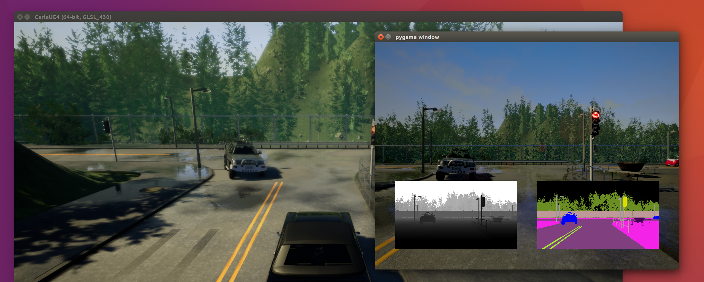
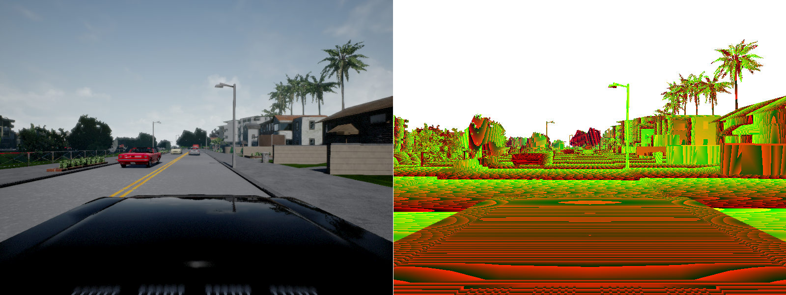

<h1>Connecting a Python client</h1>

The power of CARLA simulator resides in its ability to be controlled
programmatically with an external client. This client can control most of the
aspects of simulation, from environment to duration of each episode, it can
retrieve data from different sensors, and send control instructions to the
player vehicle.

PythonClient contents
---------------------

In the release package, inside the _"PythonClient"_ folder, we provide the
Python API module together with some use examples.

File or folder           | Description
------------------------ | ------------
carla/                   | Contains the "carla" module, the Python API for communicating with the simulator.
client_example.py        | Basic usage example of the "carla" module.
manual_control.py        | A GUI client in which the vehicle can be controlled manually.
point_cloud_example.py   | Usage example for converting depth images into a point cloud in world coordinates.
run_benchmark.py         | Run the CoRL'17 benchmark with a trivial agent.

!!! note
    If you are building CARLA from source, the Python code is inside the
    _"PythonClient"_ folder in the CARLA repository. Bear in mind that the
    `master` branch contains latest fixes and changes that might be incompatible
    with the release version. Consider using the `stable` branch.

Install dependencies
--------------------

We recommend using Python 3.5, but all the Python code in the "carla" module and
given examples is also compatible with Python 2.7.

Install the dependencies with "pip" using the requirements file provided

    $ pip install -r PythonClient/requirements.txt

Running the client example
--------------------------

The "client_example.py" script contains a basic usage example for using the
"carla" module. We recommend taking a look at the source-code of this script if
you plan to familiarize with the CARLA Python API.

<h4>Launching the client</h4>

The script tries to connect to a CARLA simulator instance running in _server
mode_. Now we are going to launch the script with "autopilot" enabled

    $ ./client_example.py --autopilot

The script now will try repeatedly to connect with the server, since we haven't
started the simulator yet it will keep printing an error until we launch the
server.

!!! note
    By default CARLA uses the ports 2000, 2001, and 2002. Make sure to have
    these ports available.

<h4>Launching the simulator in server mode</h4>

To launch CARLA simulator in **server mode** we just need to pass the
`-carla-server` argument

    $ ./CarlaUE4.sh -carla-server

Once the map is loaded, the vehicle should start driving around controlled by
the Python script.

!!! important
    Before you start running your own experiments, it is important to know the
    details for running the simulator at **fixed time-step** for achieving
    maximum speed and repeatability. We will cover this in the next item
    [Configuring the simulation](configuring_the_simulation.md).

<h4>Saving images to disk</h4>

Now you can stop the client script and relaunch it with different options. For
instance now we are going to save to disk the images of the two cameras that the
client attaches to the vehicle

    $ ./client_example.py --autopilot --images-to-disk

And _"_out"_ folder should have appeared in your working directory containing each
captured frame as PNG.

You can see all the available options in the script's help

    $ ./client_example.py --help

<h4>Running other examples</h4>

The other scripts present in the _"PythonClient"_ folder run in a similar
fashion. We recommend now launching _"manual_control.py"_ for a GUI interface
implemented with PyGame.
